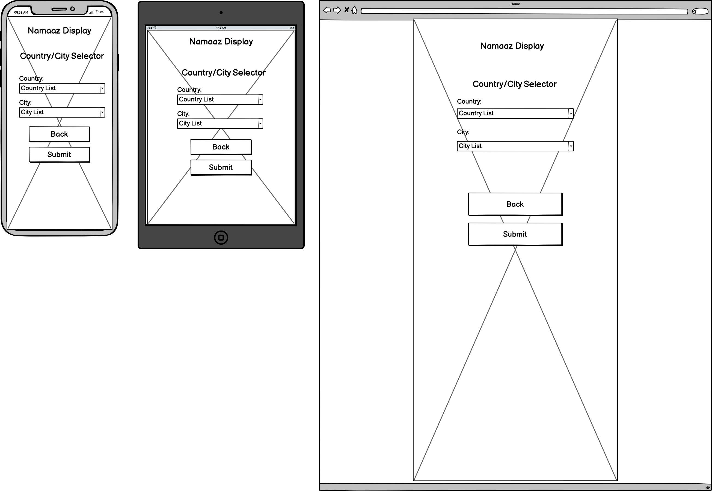

# Namaaz Display

The [Namaaz Display](https://hussain-naik.github.io/PP2-Namaaz-Display/) website allows people to find Namaaz times for a given city location or gps coordinates. The website also displays a timer for time remaining to perform current prayer.

---
## User stories

### First time visitor goals
- As a first time visitor I want to find what time prayers are so i can perform my salaah
- As a first time visitor I want the site Responsive on my device so that i can benefit from prayer times in any situation
- As a first time visitor I want the site to be easy to navigate so i do not waste much time

### Returning visitor goals
- As a returning visitor I want to know how long remaining for current prayer so i can adjust my schedule

### Frequent visitor goals
- As a Frequent visitor I want to know prayer times in different cities when am traveling
- As a Frequent visitor I want to know next day prayer times to avoid missing my prayers

---
## Technologies Used

- [HTML](https://developer.mozilla.org/en-US/docs/Web/HTML) - was used as the foundation of the site
- [CSS](https://developer.mozilla.org/en-US/docs/Web/css) - was used to add the styles and layout of the site.
- [Font Awesome icons](https://fontawesome.com/) - was used for icons and spinning wheel for fetch delay
- [Google fonts](https://fonts.google.com/) - was used for the fonts on the website
- [VSCode](https://code.visualstudio.com/) - was used as the main tool to write and edit code.
- [Canva](https://www.canva.com/) - was used to create the background for the website
- [Git](https://git-scm.com/) - was used for the version control of the website.
- [GitHub](https://github.com/) - was used to host the code of the website.
- [JavaScript](https://developer.mozilla.org/en-US/docs/Web/JavaScript) - was used to add functionality to the website
- [Balsamiq Wireframes](https://balsamiq.com/) - was used to make the wireframes
- [Postman](https://en.wikipedia.org/wiki/Postman_(software)) - was used for testing API requests
- [Geonames](https://www.geonames.org/export/web-services.html) - API used to populate country and city options
- [Aladhan](https://aladhan.com/prayer-times-api) - API used to get and display prayer times

---
## Design

The website was designed with app like feature rather than a traditional website with link navigation.

### Wireframe

- Index Page Mockup

- City Form Selector Mockup

- Results Page Mockup

- Error Page Mockup

### Color Scheme

- Main color 60% of site #20232F Raisin Black
- Secondary color 30% of site #F3FCF0 Honeydew
- Action Color 10% of site #C3B367 Ecru
- Form Validation #FF0000 Red

### Typography

- Google Fonts
    - [Oxygen](https://fonts.google.com/specimen/Oxygen?query=oxygen) - used for heading and logo
    - [Roboto](https://fonts.google.com/specimen/Roboto?query=Roboto) - used for remaining body text

---
## Features

### Home page

The home page of website displays the sites name as a title and then a container which holds some information text, the title also acts as a link to return to the website landing page. Below this are two buttons, By City and By Location.
### City Selector page

The City Selector display inform the user to select a country and city to view prayer times in the selected city. There are two new button, Back and Submit.
### Form Validation

As the page is Javascript DOM Manipulate the form action has been disabled and a manual javascript validation prompting the user to select options from the given dropdown. The Country and City Drop down use the geonames API to populate the options.
### API Prayer Times

The Prayer times result page displays the current device time with georgian date and islamic date. Each prayer start time is displayed and the current active prayer also displays a timer with a circular progress bar. The active prayer changes once the prayer end time has been passed. The prayers that have passed invert the colors and add opacity to remove focus and display pray start time for next day.
### No Geolocation Error

When device location has been set to not allow a custom error will be displayed if the user clicked the By Location button on the landing page. User has option to click the Back button to go back to previous page or the title to return to home page

### API Fetch Error

A custom error message will be displayed if there was an incorrect option selected or error in the API fetch. User has option to click the Back button to go back to previous page or the title to return to home page

### Custom 404 page

Custom 404 error page set with links to index page. The title and additional button both return the user back to main landing page.

---
## Testing

### Full Testing

Full testing was performed on the following devices:

- Desktop:
  - Mac Mini 2014
- Mobile Devices:
  * iPhone SE (3rd Gen).
  * iPhone X

Each device tested the site using the following browsers:

* Google Chrome
* Safari
* Firefox

| Feature | Expected Outcome | Testing Performed | Result | Pass/Fail |
| --- | --- | --- | --- | --- |
| The Sites title | Link directs the user back to the home page | Clicked title | Home page reloads | Pass |
| All Link - hover effect | Animation of green underline when hovered | Hover over all links on page | Each link displayed correct styling when hovered over | Pass |
| Click By City | Display City Selection Form | Clicked By City | Display Form with Country and City Selection | Pass |
| Click By Location (Allow location)| Load Prayers times for given location | Clicked By Location | Correct location prayer data displayed | Pass |
| Click By Location (restrict location) | Error as Fetch request passed without location parameters | Clicked By Location without user location permission | Custom error displayed stating location permission required | Pass |
| Click Back after By Location | Display Initial Landing Page | Clicked Back | Returned to Initial Display | Pass |
| Click Back after By City | Display Initial Landing Page | Clicked Back | Returned to Initial Display | Pass |
| Click Back after By Location Error | Display Initial Landing Page | Clicked Back | Returned to Initial Display | Pass |
| Click Back after By City Error | Display Initial Landing Page | Clicked Back | Returned to Initial Display | Pass |
| Populate City Selector based on Country | Data List input populated based on country | Selected Country | Cities Populated based on country | Pass |
| Country List Dropdown | Users will see a drop-down list of the pre-defined options as they input data | Begin Typing in Country input | List displayed Country | Pass |
| Assign Country code | Selecting Country from data list will assign Country Code to input field | Selected Country from list | Country Code displayed in input field | Pass |
| City List Dropdown | Users will see a drop-down list of the pre-defined options as they input data | Begin Typing in City input | List displayed Cities | Pass |
| Assign City to input | Selecting City from data list will assign City to input field | Selected a City from list | Chosen City displayed in input field | Pass |
| Click Submit (Inputs Selected) | Load Prayers times for given city | Clicked Submit | Correct location prayer data displayed | Pass |
| Click Submit (City Input Empty) | Required Input prompt user to select a City | Clicked Submit with city input empty | City Label changed color to red requesting user to select | Pass |
| Click Submit (Country Input Empty) | Required Input prompt user to select a Country | Clicked Submit with country input empty | Country Label color changed to red requesting user to select | Pass |
| Click Submit (Both Inputs Empty) | Required Inputs prompt user to select a Country and City | Clicked Submit with inputs empty|  Label color changed to red requesting user input | Pass |
| Click Submit (Country Input invalid) | Error as Fetch request passed with invalid parameters | Clicked Submit with invalid country | Custom error displayed with button to go back | Pass |
| Click Back after Submit | Display Form City Selector | Clicked Back | Country/City Selector form displayed | Pass |
| Click Back after Submit Error | Display Form City Selector | Clicked Back | Country/City Selector form displayed | Pass |
| Custom 404 page | Display custom 404 page | Enter random text in website url path | Custom 404 page displayed | Pass |
| Click Back after 404 error | Display index page | Clicked Back | Home page displayed | Pass |
| Spinning wheel for API delay | Prayer start time displays spinning wheel | clicked submit | Spinning wheel while API information was fetched | Pass |
| Spinning wheel for API delay | Prayer start time displays spinning wheel | clicked By Location | Spinning wheel while API information was fetched | Pass |
| Invert prayer display when exceeded time | Prayer time passed change style | Manually adjusted device time till end of prayer time | Prayer style inverted | Pass |
| Add timer to current active prayer | Countdown timer indicating remaining time to perform prayer | Manually adjusted device time | Timer added for each prayer depending on start time | Pass |
| Timer Animation | Circular progress bar around timer | Manually adjusted device time | Animated for 1% of time remaining | Pass |
| Timer to display 00:00 for when delay after prayer end and next prayer start time | Displays timer without updating time | Manually adjusted time on device | Timer after Fajr end and Zohar start displays zero timer | Pass |
| Timer before true midnight | Timer should be displayed for Isha prayer | Manually adjusted device time | Isha end time is true midnight timer displayed for Isha prayer | Pass |
| Timer Title | Display Remaining time for Prayer | Manually adjusted device time | Default Title displayed when mouser hover over timer | Pass |
| Timer Title before prayer start | Display Prayer not started | Manually adjusted device time | Set Title displayed when mouser hover over timer | Pass |

---
## Bugs

### Solved Bugs

- Fix API month parameter as getMonth() returns value from 0-11
    - +1 to month value for current month

- Timer countdown was inserted for each prayer
    - Function to insert timer placed after if statement and removed first timer sibling

- Timer percentage need to convert current time to seconds to compare and calculate percentage
    - Calculate correct percentage from remaining time left

- API fetch data for month unable to get next day when end of month
    - Added two single date API request for current and next day

- When deployed on GitHub the website was broken due to the GitHUb security for API requests
    - Changed request to https and add secure prefix for geonames.
    
### Unsolved Bugs

- None

### Mistakes

- Commit without Add Prefix

---
## Validator Testing

### HTML Validator

- Home Page no errors or warnings were found when passing through the official W3C validator.

### CSS Validator

- No errors or warnings were found when passing through the official W3C (Jigsaw)

### JavaScript Validator

[jshint](https://jshint.com/) was used to validate the JavaScript.
- 

### Lighthouse Accessibility and Performance

- Home Page using lighthouse in devtools I confirmed that the page is performing well, accessible and colors and fonts chosen are readable.

---
## Deployment

- The site was deployed to GitHub pages. The steps to deploy are as follows: 
  - In the [GitHub repository](https://github.com/Hussain-Naik/PP2-Namaaz-Display), navigate to the Settings tab 
  - From the source section drop-down menu, select the **Main** Branch, then click "Save".
  - The page will be automatically refreshed with a detailed ribbon display to indicate the successful deployment.

The live link can be found [here](https://hussain-naik.github.io/PP2-Namaaz-Display)

- In order to make a local copy of this project, you can clone it. In your IDE Terminal, type the following command to clone my repository:

- `git clone https://github.com/Hussain-Naik/PP2-Namaaz-Display.git`
---
## Future Improvements

- Add a digital clock font to time.
- Add feature for hanafii school prayer times as they differ slightly.
- Add refresh to results at midnight to retrieve new data.
- Add reverse geolocation to display user city rather than coordinates.
- Add additional information for islamic relevance dates.
- Add feature for when prayer can not be performed.

---
## Credits

- The background for the website was created using [canva](https://www.canva.com/).
- favicon was made using [faviconer.com](http://www.faviconer.com/).

---
## Acknowledgments

- Due to the nature of the project the first form of acknowledgement is to Allah with the common islamic phrase Alhamdulillah (roughly equivalent to "thank God". Literally it means "all praise is to God")
- [Aleksei Konovalov](https://github.com/lexach91) great guidance and mentor throughout project
- [Code Institute](https://codeinstitute.net/) tutors and Slack community members for their support and help.
- [Kevin Powell](https://www.youtube.com/user/KepowOb) Flex display tutorials.
- [Coding Artist](https://www.youtube.com/@CodingArtist) CSS hover animation tutorial.
- [David Fekke](https://fek.io/blog/how-to-observe-changes-to-the-dom-without-using-a-java-script-framework/) Documentation on Dom changes without a javascript framework.
- [Muhammad Irshad - Online Tutorials](https://www.youtube.com/@OnlineTutorialsYT) tutorial on how to make animated circular timer.

---