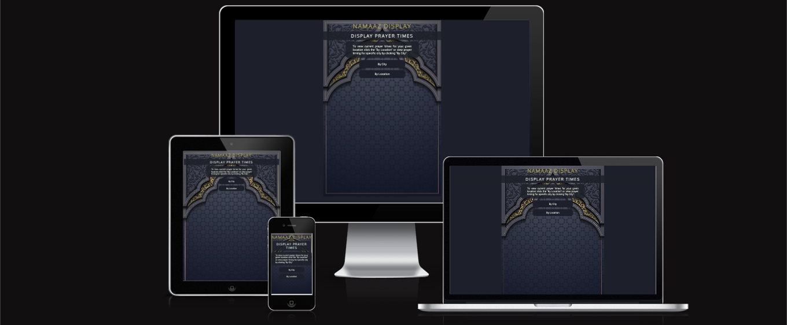
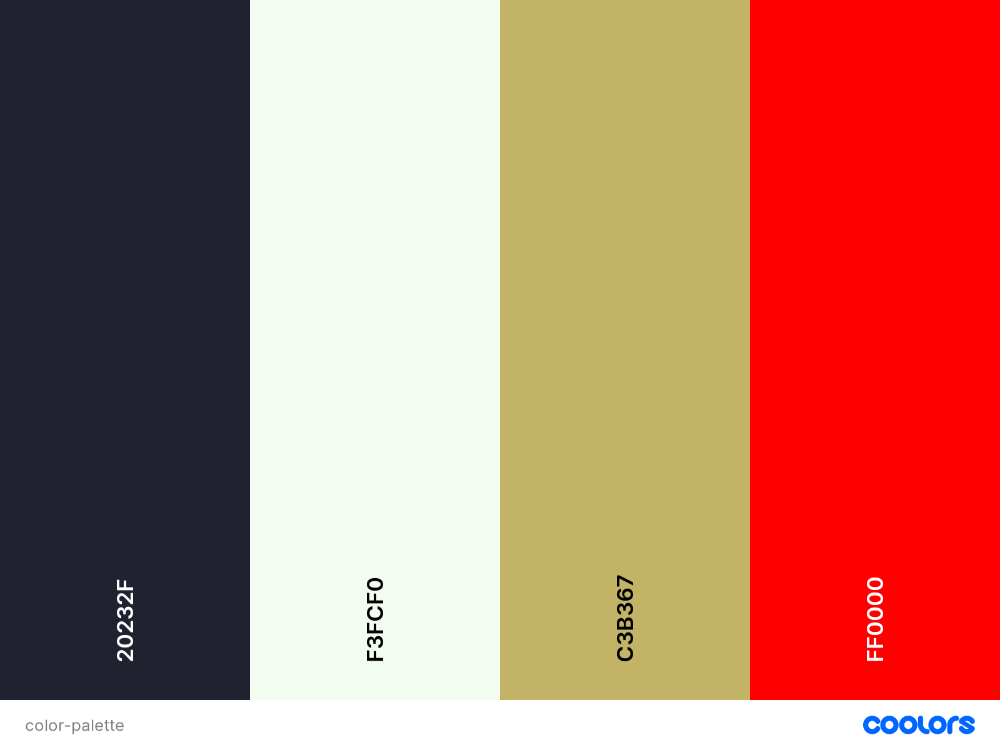

# Namaaz Display

The [Namaaz Display](https://hussain-naik.github.io/PP2-Namaaz-Display/) website allows people to find namaaz times for a given city location or gps coordinates. The website also displays a timer for time remaing to perform current prayer.

---
## User stories

### First time visitor goals
- I want to know what time each islamic prayer is
- I want the site Responsive on my device
- I want the site to be easy to navigate

### Returning visitor goals
- I want to know how long remaining for current prayer

### Frequent visitor goals
- I want to know prayer times in different cities
- I want to know next day prayer times to avoid missing my prayers

---
## Technologies Used

- [HTML](https://developer.mozilla.org/en-US/docs/Web/HTML)
- [CSS](https://developer.mozilla.org/en-US/docs/Web/css)
- [Font Awesome icons](https://fontawesome.com/)
- [Google fonts](https://fonts.google.com/)
- [VSCode](https://code.visualstudio.com/)
- [Canva](https://www.canva.com/)
- [Git](https://git-scm.com/)
- [GitHub](https://github.com/)
- [JavaScript](https://developer.mozilla.org/en-US/docs/Web/JavaScript)
- [Balsamiq Wireframes](https://balsamiq.com/)

---
## Design

### Wireframe

- Index Page Mockup

- City Form Selector Mockup

- Results Page Mockup

- Error Page Mockup

### Color Scheme

- Main color 60% of site #F6F8FF Ghost White
- Secondary color 30% of site #50453F Taupe
- Action Color 10% of site #7BAE7F Cambridge blue

### Typography

- Google Fonts
    - [Oxygen](https://fonts.google.com/specimen/Oxygen?query=oxygen) - used for heading and logo
    - [Roboto](https://fonts.google.com/specimen/Roboto?query=Roboto) - used for remaing body text

---
## Features

---
## Testing

### Full Testing

Full testing was performed on the following devices:

- Decktop:
  - Mac Mini 2014
- Mobile Devices:
  * iPhone SE (3rd Gen).
  * iPhone X

Each device tested the site using the following browsers:

* Google Chrome
* Safari
* Firefox

| Feature | Expected Outcome | Testing Performed | Result | Pass/Fail |
| --- | --- | --- | --- | --- |
| The Sites title | Link directs the user back to the home page | Clicked title | Home page reloads | Pass |
| Home link | Link directs the user back to the home page | Clicked link | Home page reloads | Pass |
| About Us link | Link scrolls to about us section on home page | Clicked link | page scrolls down until about us section | Pass |
| Events link | Link scrolls to events section on home page | Clicked link | page scrolls down until events section | Pass |
| Prayer Times link | Link directs the user to Prayer Times page | Clicked link | Prayer Times Page loads | Pass |
| Contact Us link | Link directs the user to Contact page | Clicked link | Contact Page loads | Pass |
| Get in Touch button | Link directs the user to Contact page | Clicked button | Contact Page loads | Pass |
| Facebook icon | Link directs the user to Facebook site | Clicked link | Facebook opens in new tab | Pass |
| Twitter icon | Link directs the user to Twitter site | Clicked link | Twitter opens in new tab | Pass |
| Youtube icon | Link directs the user to Youtube site | Clicked link | Youtube opens in new tab | Pass |
| Instagram icon | Link directs the user to Instagram site | Clicked link | Instagram opens in new tab | Pass |
| All Link - hover effect | Animation of green underline when hovered | Hover over all links on page | Each link displayed correct styling when hovered over | Pass |

---
## Bugs

### Solved Bugs

- Navigation logo too large was set with fixed width
    - Solved by removing width on logo and setting hr background color to fill remaining navigation

- Redirect not working on response page
    - Solved by adding index file path to url.

- Home contact section chat image background
    - Changed to img and wrapped left and right class in new div with 100% width and display flex

- Contact form textarea resizable
    - Added CSS rule to only resize vertically and added max height to input

### Unsolved Bugs

- None

### Mistakes

- Commit without Add Prefix

---
## Validator Testing

### HTML Validator

- Home Page no errors or warnings were found when passing through the official W3C validator.

### CSS Validator

- No errors or warnings were found when passing through the official W3C (Jigsaw)

### JavaScript Validator

- No errors or warnings were found when passing through the official W3C (Jigsaw)

### Lighthouse Accessibility and Performance

- Home Page using lighthouse in devtools I confirmed that the page is performing well, accessible and colors and fonts chosen are readable.

---
## Deployment

- The website was deployed to GitHub pages and can be accessed by the link: [Namaaz Display](https://hussain-naik.github.io/PP2-Namaaz-Display/)

- In order to make a local copy of this project, you can clone it. In your IDE Terminal, type the following command to clone my repository:

- `git clone https://github.com/Hussain-Naik/PP2-Namaaz-Display.git`
---
## Future Improvements

- Add a digital clock font to time.
- Add feature for hanafii school prayer times as they differ slightly.
- Add refresh to results at midnight to retrive new data.
- Add reverse geolocation to display user city rather than coordinates.
- Add addional information for islamic relevance dates.

---
## Credits

- All images are taken from [unsplash](https://unsplash.com/), [pixabay](https://pixabay.com/) and [freepik](https://www.freepik.com/) website or created using [canva]().
- favicon was made using [faviconer.com](http://www.faviconer.com/).

---
## Acknowledgments

- Due to the nature of the project the first form of acknowledegement is to Allah with the common islamic phrase Alhamdulillah (roughly equivalent to "thank God". Literally it means "all praise is to God")
- [Aleksei Konovalov](https://github.com/lexach91) great guidance and mentor throughout project
- [Code Institute](https://codeinstitute.net/) tutors and Slack community members for their support and help.
- [Kevin Powell](https://www.youtube.com/user/KepowOb) Flex display tutorials.
- [Coding Artist](https://www.youtube.com/@CodingArtist) CSS hover animation tutorial.

---